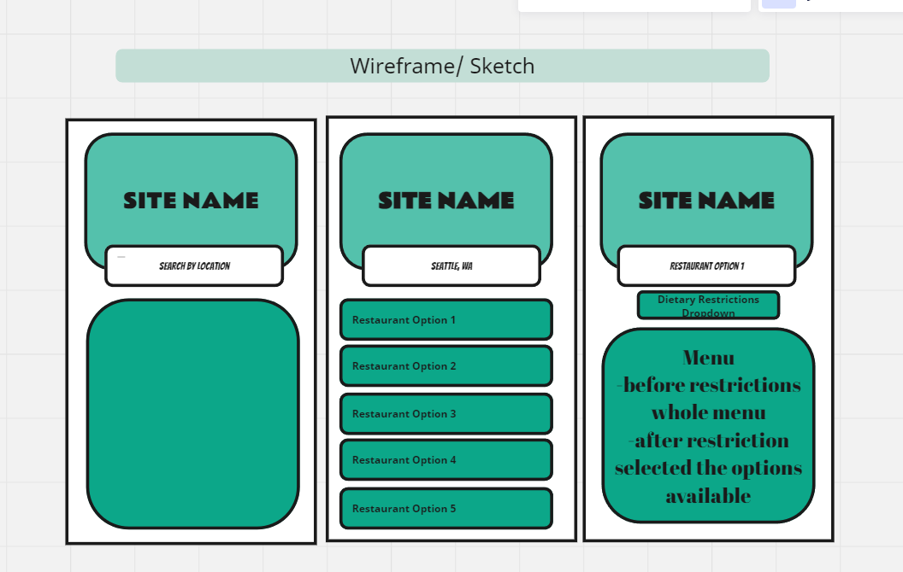

# bootcampWeekSevenProject

Title:  Menu Mate

Project Description: Web application that will fetch local restaurants and filter out certain dietary restrictions on the menu based off of user input.

User Story: As a User, I want to find restaurants near my location, 
filter the menu based off of my dietary preferences, 
in order to save time while ordering. 

Wireframe/Sketch

APIs Used:  
geolocation API: https://incoderweb.blogspot.com/2022/03/how-to-detect-user-location.html  
restaurant/menu API: https://rapidapi.com/restaurantmenus/api/documenu  

Tasks:  
Adam: HTML/js  
Larissa: HTML/general css  
chris: HTML/css revision  
James: HTML/js

